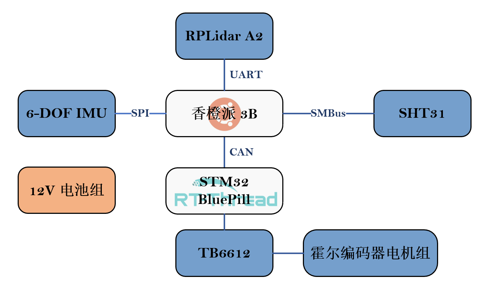

# 整体架构

## 硬件

> IMU 改连 STM32

### 主控

|      设备      |         操作系统          |
| :------------: | :-----------------------: |
|    香橙派3B    | Ubuntu 20.04 + ROS Neotic |
| STM32 BluePill |      RT-Thread Nano       |

### 设备

RPLidar A2M8

SHT31 温湿度传感器

TB6612 驱动板

霍尔编码器电机 x 2

